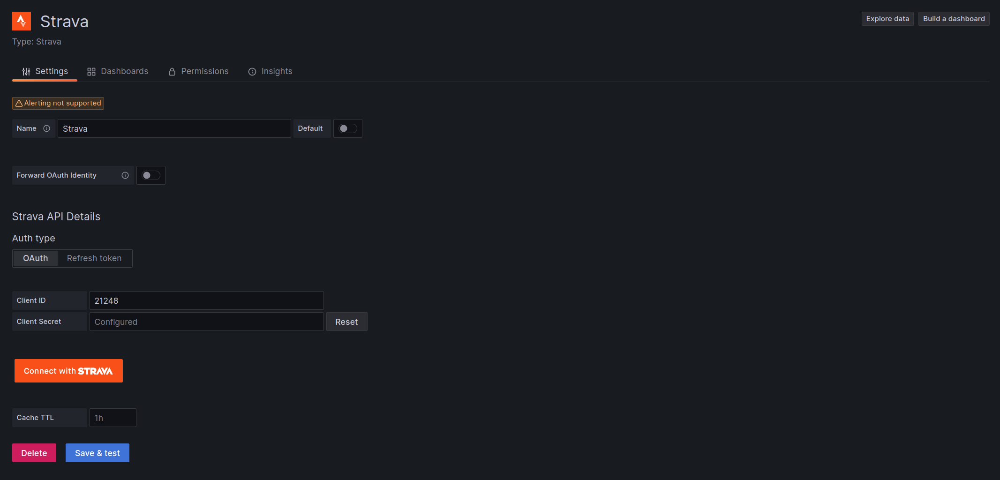

# Strava datasource for Grafana

Visualize your sport activity with Grafana.


Features:

- Query activities stats and present it as a time series data.
- Table format.
- Show activities over the world with [Geomap Panel](https://grafana.com/docs/grafana/latest/visualizations/geomap/).
- Visualize and analyze activity data such as heart rate, speed/pace, power, etc.
- Template variables support.

## Configuration

In order to start using Strava datasource you will need to make a Strava API application.

1. After you are logged in, go to https://www.strava.com/settings/api and create an app.
2. Fill out the form fields:
   - Application name: pick any name you want, ie "grafana data source".
   - Category: choose app category, for example, "Visualizer".
   - Club: select a club if you want to associate app with a particular club.
   - Website: set to anything you want, it's used primarily for publicly available apps.
   - Application Description: add description if you want
   - **Authorization Callback Domain**: set it to domain you're using to access Grafana. If you're using Grafana at localhost, you can put anything here, `localhost` and `127.0.01` are white-listed. If you're running plugin at Grafana Cloud, set it to your cloud instance domain, ie `myorg.grafana.net`. If you're accessing grafana via IP-address, ie `192.168.1.10`, set callback domain to that address.
3. You should see the “My API Application” page with Client ID, Client Secret and Refresh token and other information.

Learn more about Strava API applications at [Strava developer docs](https://developers.strava.com/docs/getting-started/#account).

## Enable externalServiceAccounts feature

Plugin requires `externalServiceAccounts` feature toggle to be enabled. It could be done in config file:

```ini
[feature_toggles]
externalServiceAccounts = true
```

or through ENV variables:

```yaml
services:
  # Grafana
  grafana:
    image: grafana/grafana:latest
    ports:
      - "3000:3000"
    environment:
      - GF_INSTALL_PLUGINS=grafana-strava-datasource
      - GF_FEATURE_TOGGLES_ENABLE=externalServiceAccounts
```

Then go to grafana and create new Strava datasource.



Set desired data source name and fill _Client ID_ and _Client Secret_ fields with values obtained from Strava API application page. Save data source configuration (you'll get an error, but it's ok since data source not authorized yet). Then click _Connect with Strava_ button and authorize grafana datasource to connect to Strava.


If you get `redirect_uri invalid` error after clicking _Connect with Strava_, that means Authorization Callback Domain not properly configured. Get back to the Strava API application config and make sure you set it to exactly the same domain you use to open Grafana in your browser.

You will be redirected back to the datasource configuration page. Click _Save & Test_ button and if connection is properly configured, you will see _Data source is working_ message.


Now you can create some dashboards! Also, you can import dashboards from the _Dashboards_ tab at the data source configuration page.

## Importing dashboards

Once data source is configured, you can import pre-configured dashboards from _Dashboards_ tab at the data source configuration page. That's a good starting point for your own custom dashboards.

Unfortunately, Strava API has some limitations and you can query only your own activities. But for multi-user dashboards you can configure multiple data sources and authorize separate users for each of them.

Some included dashboards depend on Grafana's new version of the panels or features which can be in alpha state in Grafana. If you want to [enable alpha panels](https://grafana.com/docs/grafana/latest/setup-grafana/configure-grafana/#enable_alpha) and avoid seeing an error message in the dashboard, set `GF_PANELS_ENABLE_ALPHA` environment variable to true. Example:

```sh
export GF_PLUGINS_ENABLE_ALPHA=true
```

or add config options to `grafana.ini`:

```ini
[panels]
enable_alpha = true
```

## Advanced

### Cache TTL

Plugin uses cache on the backend to store information of activities. This helps to reduce API usage and prevent rate limiting. Plugin basically caches everything except the list of activities on the "Strava Athlete Dashboard" (those activities cached, but with the short non-configurable interval). So if you updated activity information in Strava (ie, name, gear, etc), you don't see updates in Grafana until cache is refreshed. You can manually reset cache by clicking _Save and Test_ button at the data source config page.

### Forward OAuth identity

It's possible to configure Grafana to authenticate users with Strava and then pass through OAuth identity to the data source.
This makes it possible for users to see its own data on dashboards without creating new data source for each user. To enable
Strava authentication, add this section to the grafana config file:

```ini
[auth.generic_oauth]
name = Strava
icon = signin
enabled = true
allow_sign_up = true
client_id = YOUR_APP_CLIENT_ID
client_secret = YOUR_APP_CLIENT_SECRET
scopes = activity:read_all
# Strava does not expose user's email, so use username to prevent error
email_attribute_path = username
login_attribute_path = username
name_attribute_path = join(' ', [firstname, lastname])
auth_url = https://www.strava.com/oauth/authorize
token_url = https://www.strava.com/api/v3/oauth/token
api_url = https://www.strava.com/api/v3/athlete
```

Restart grafana server, then activate _Forward OAuth Identity_ toggle in data source config and press _Save and test_ button.
