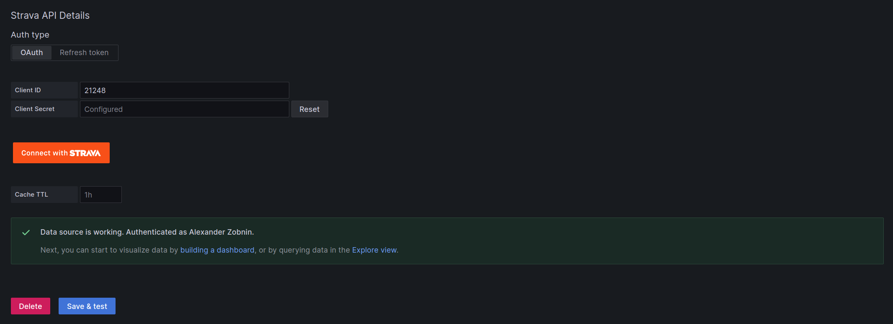

# Strava Datasource Configuration

In order to start using Strava datasource you will need to make a Strava API application.

1. After you are logged in, go to https://www.strava.com/settings/api and create an app.
2. You should see the “My API Application” page now. Here is what everything means:
   - Category: The category you chose for your application
   - Club: Will show if you have a club associated with your application
   - Client ID: Your application ID
   - Client Secret: Your client secret (please keep this confidential)
   - Authorization token: Your authorization token which will change every six hours (please keep this confidential)
   - Your Refresh token: The token you will use to get a new authorization token (please keep this confidential)
   - Rate limits: Your current rate limit
   - Authorization Callback Domain: set it to domain you're using to access Grafana. If you're using Grafana at localhost, you can put anything here, `localhost` and `127.0.01` are white-listed. If you're running plugin at Grafana Cloud, set it to your cloud instance domain, ie `myorg.grafana.net`.

Learn more about Strava API applications at [Strava developer docs](https://developers.strava.com/docs/getting-started/#account).

Then go to grafana and create new Strava datasource.


Fill _Client ID_ field with value obtained from Strava API application page. Click _Connect with Strava_ button and authorize grafana datasource to connect to Strava.


You will be redirected back to the datasource configuration page. Now fill _Client ID_ and _Client Secret_ fields. Finally, set desired data source name and click _Save & Test_ button. If connection is properly configured, you will see _Data source is working_ message.



Now you can create some dashboards! Also, you can import dashboards from the _Dashboards_ tab at the data source configuration page.

## Custom data directory

By default, plugin stores data in user cache directory (ie `$HOME/.cache` on Linux or `%LocalAppData%` on Windows). If you need to change this directory, set `GF_STRAVA_DS_DATA_PATH` environment variable. This directory is used for storing obtained refresh tokens and make it available after plugin restart. Make sure user that runs grafana-server has write access to that directory.

```sh
mkdir /var/lib/grafana/strava
export GF_STRAVA_DS_DATA_PATH=/var/lib/grafana/strava
```

## Forward OAuth identity

It's possible to configure Grafana to authenticate users with Strava and then pass through OAuth identity to the data source.
This makes it possible for users to see its own data on dashboards without creating new data source for each user. To enable
Strava authentication, add this section to the grafana config file:

```ini
[auth.generic_oauth]
name = Strava
icon = signin
enabled = true
allow_sign_up = true
client_id = YOUR_APP_CLIENT_ID
client_secret = YOUR_APP_CLIENT_SECRET
scopes = activity:read_all
# Strava does not expose user's email, so use username to prevent error
email_attribute_path = username
login_attribute_path = username
name_attribute_path = join(' ', [firstname, lastname])
auth_url = https://www.strava.com/oauth/authorize
token_url = https://www.strava.com/api/v3/oauth/token
api_url = https://www.strava.com/api/v3/athlete
```

Restart grafana server, then activate _Forward OAuth Identity_ toggle in data source config and press _Save and test_ button.
